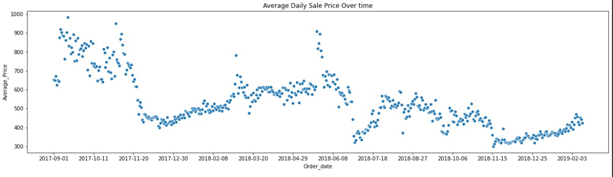
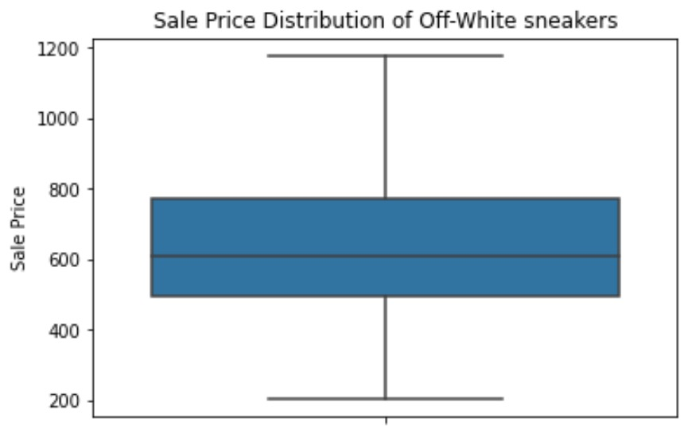
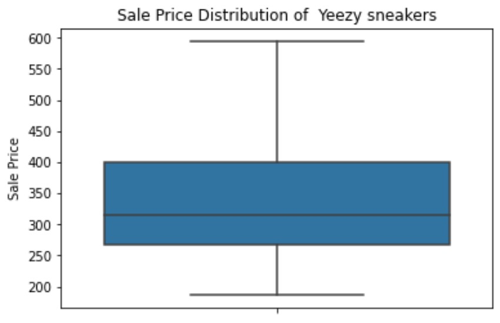
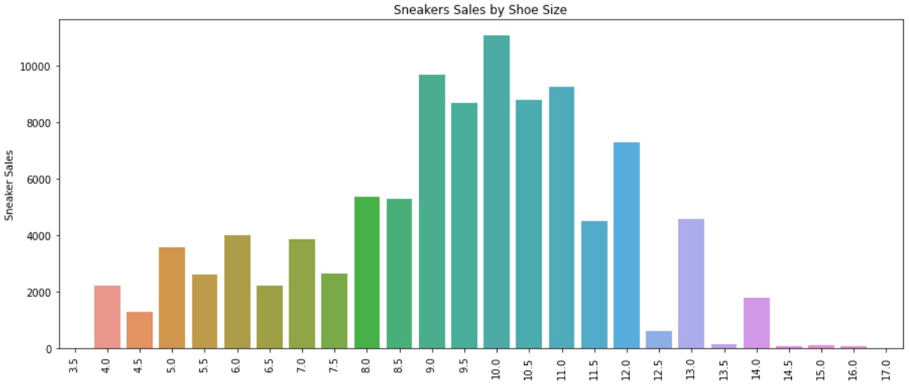
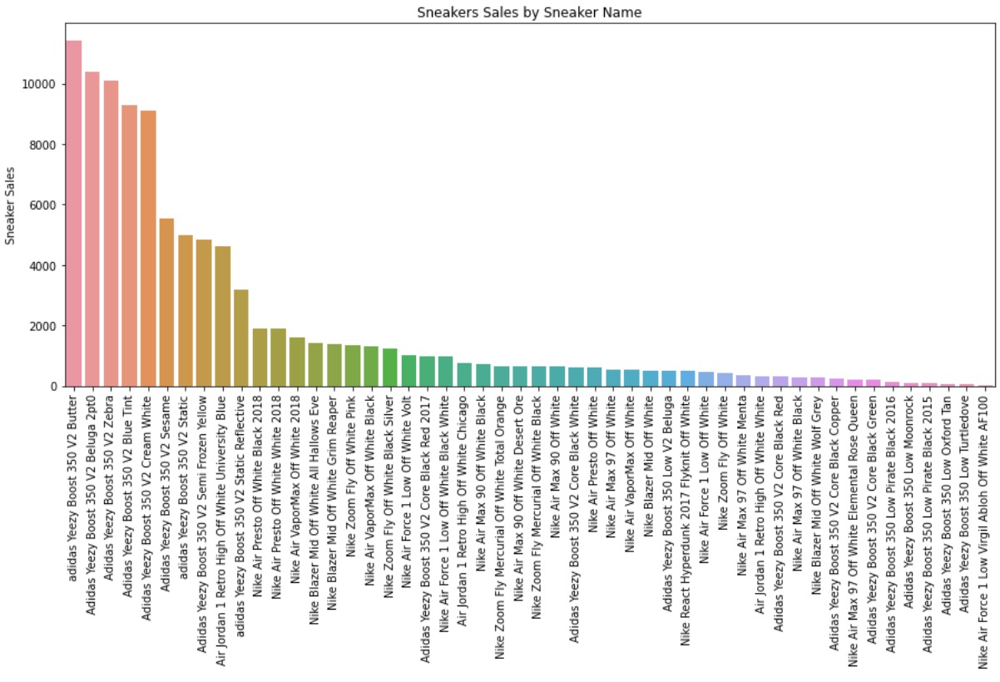

# StockX Sneaker Price Prediction Project

The purpose of this project is to predict the resale price of a sneaker based on several factors like the type of sneaker and buyer region.


[](https://opensource.org/licenses/MIT)

## Demo


## Intro

The Footwear industry consists of companies engaged in the manufacturing of footwear such as dress shoes, slippers, boots, galoshes, sandals and athletic and trade related footwear; however, the most lucrative sector of this industry is collectible sneakers. The rise of marketplace apps like StockX and GOAT, alongside the proliferation of social media sites where you’re just one message away from turning a rare pair of trainers into cash, mean that more people are selling their shoes than ever before. The global sneaker resale market has been valued at over $2 billion, while the right pair of kicks can go for over $10,000. Moreover, the massive margin of profit for each shoe makes the resale market attractive to those who would like to make some extra cash, given that in the past year, the average profit margin in the sneaker industry was 42.5%.

While there is plenty of money to be made, it can be risky to buy a shoe due to the volatile nature of each shoe. Sneakers are like stocks with their resale price constantly changing from day to day. Thus, I developed this web application to predict the price of a given shoe based on factors such as date, shoe size, buyer region, and more. 

This tool resolves the issue of knowing which sneaker is worthwhile and when to buy it.

## Table of Contents
- [Title](#stockx-sneaker-price-prediction-project)
- [Demo](#demo)
- [Intro](#intro)
- [Table of contents](#table-of-contents)
- [Installation](#installation)
- [Usage](#usage)
- [Development](#development)
- [License](#license)
- [Footer](#footer)

## Getting Started

### Installation

Clone this repo, create a blank Anaconda environment, and install the requirements file.
```bash
# Creates new environment called 'stockx-env'
conda create -n stockx-env python=3.8
# Activates the environment we just made
conda activate stockx-env
# Install the requirements
pip install -r requirements.txt
```

### Usage

Make sure to run the app from the `application/` directory.
```bash
cd application
python app.py
```
### Understanding the Data

Description of the data from StockX:

"The data we’re giving you consists of a random sample of all Off-White x Nike and Yeezy 350 sales from between 9/1/2017 (the month that Off-White first debuted “The Ten” collection) and the present. There are 99,956 total sales in the data set; 27,794 Off-White sales, and 72,162 Yeezy sales. The sample consists of U.S. sales only.

To create this sample, we took a random, fixed percentage of StockX sales (X%) for each colorway, on each day, since September 2017. So, for each day the Off-White Jordan 1 was on the market, we randomly selected X% of its sale from each day. (It’s not important to know what X is; all that matters is that it’s a random sample, and that the same fixed X% of sales was selected from every day, for every sneaker). Every row in the spreadsheet represents an individual StockX sale. There are no averages or order counts; this is just a random sample of daily sales data."









## Development

## Model Building 

I split the data into train and tests sets with a test size of 20%. 

I selected three models:
* Random Forest Regressor
* XGBoost
* Decision Tree Regressor

I chose these models because they all had enough variation in their functionality that I thought would be useful due to their evaluation methods for this classification problem. The Random Forest Classifier is, well, random. XGBoost uses a number of nifty tricks like computing second-order gradients, i.e. second partial derivatives of the loss function (similar to Newton’s method). The KNN Classifier finds the distances between a query and all the examples in the data, selecting the specified number examples (K) closest to the query, then votes for the most frequent label. And finally, the Gradient Boost Classifier uses the loss function of the base model (e.g. random forest) as a proxy for minimizing the error of the overall model. 

### Model performance
The Random Forest model far outperformed the other approaches on the test and validation sets. 
*	**Random Forest Classifier** : 0.771
*	**XGBoostClassifier**: 0.78
*	**KNeighborsClassifier**: 0.77
*	**GradientBoostingClassifier**: 0.85

The GradientBoostingClassifier far outperformed the other approaches on the test and validation sets. 

## Productionization 
In this step, I pickled my model and saved it into a callable object that can be used on other datasets.

## License
## Contact
